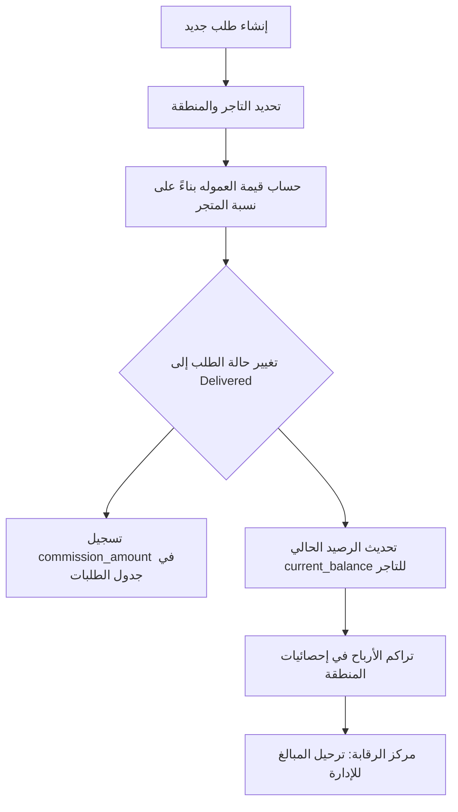

# تقرير تحليل نظام الأرباح والعمولات - تطبيق الادنت (Astra)

هذا التقرير يوضح الخريطة الكاملة لكيفية معالجة وتسجيل العمليات المالية داخل التطبيق، بدءاً من إتمام الطلب وصولاً إلى مركز الرقابة الإداري.

---

## 1. خريطة تدفق الأرباح (Profit Flow)

تبدأ دورة الربح من لحظة تحول حالة الطلب إلى "تم التوصيل" (Delivered).

---

## 2. آليات حساب العمولات (Commission Logic)

يتم التحكم في العمولات من خلال ثلاثة مستويات:

1.  **نسبة المتجر (Vendor Rate):** كل متجر له نسبة مئوية محددة في جدول `vendors`.
2.  **عمولة الطلب (Order Commission):** عند إتمام الطلب، يتم ضرب (المجموع الفرعي × النسبة) وتخزين الناتج في حقل `commission_amount`.
3.  **سجل التعديلات (Audit Log):** أي تغيير في نسبة عمولة المتجر يتم تسجيله في جدول `commission_change_logs` (يشمل: القيمة القديمة، القيمة الجديدة، ومن قام بالتعديل).

---

## 3. إدارة الديون والأرصدة (Debt Management)

النظام يعتمد على مفهوم "الرصيد الجاري" (Current Balance):

*   **الدين (Debt):** إذا كان رصيد المتجر بالسالب، فهذا يعني أن المتجر مدين للمنصة بقيمة العمولات التي لم يتم تحصيلها بعد.
*   **الأرباح التراكمية (Lifetime Profit):** هي مجموع كافة العمولات (`commission_amount`) من جميع الطلبات المسلمة بنجاح، بغض النظر عن تحصيلها نقداً أم لا.
*   **التحصيل:** يتم تصفية الديون من خلال واجهة "تسجيل الدفعات" التي تقوم بتحديث رصيد المتجر أو تسجيل سجل دفع جديد.

---

## 4. الهيكل التنظيمي للمناطق (Area Hierarchy)

يتميز النظام بقدرته على تجميع البيانات مالياً بناءً على المناطق:

*   **تجميع الإيرادات:** يتم جمع إيرادات المناطق الفرعية وإضافتها للمنطقة الرئيسية (Aggregated Revenue).
*   **ديون المناطق:** يتم حساب إجمالي المبالغ المطلوبة من كافة المتاجر التابعة لمنطقة معينة (مثلاً: منطقة الشمال تشمل ديون جنين، نابلس، وطولكرم).
*   **توريد الدفعات:** يسجل النظام تاريخ آخر توريد مالي من مشرف المنطقة إلى الإدارة المركزية عبر `area_payment_records`.

---

## 5. قاعدة البيانات والجداول المالية

| الجدول | الدور المالي |
| :--- | :--- |
| `orders` | يحتوي على `subtotal` و `commission_amount` لكل عملية. |
| `vendors` | يحتوي على `commission_rate` و `current_balance` (الرصيد الحالي). |
| `vendor_payments` | تتبع حالة الدفع الشهرية (مدفوع / غير مدفوع). |
| `vendor_payment_records` | سجل تفصيلي لكل دفعة نقدية يتم استلامها (المبلغ، التاريخ، الملاحظات). |
| `commission_change_logs` | سجل رقابي لمنع التلاعب في نسب العمولات. |
| `area_payment_records` | تتبع المبالغ المستلمة من مشرفي المناطق (Supervisors). |

---

## 6. مركز الرقابة (Audit Center)

يوفر "مركز الرقابة" في لوحة الإدارة أدوات للتحقق المالي:

1.  **سجل العمولات:** لمراقبة أي تغييرات غير مصرح بها في نسب المتاجر.
2.  **سجل التحصيل (Collection Log):** عرض حي لكافة الدفعات التي تم استلامها مؤخراً من المتاجر.
3.  **تصفية الفترات:** إمكانية عرض الأرباح بناءً على نطاق زمني محدد (يومي، شهري، أو مخصص).

---

> [!IMPORTANT]
> الأرباح المعروضة في واجهة "إيرادات المناطق" هي أرباح **تراكمية** محسوبة من العمولات، بينما الديون تعبر عن المبالغ **الفعلية** الموجودة في ذمة المتاجر حالياً.
